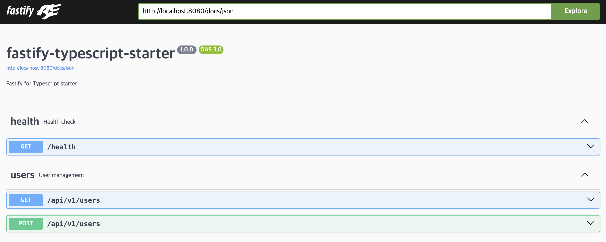

# Fastify Typescript Starter

## 구성

- **REST API**
- **DDD(Domain Driven Design)**
- **Layered Architecture**
- Fastify Framework
- Open API
- Jest testing
- Docker build

## 1. Why use Fastify 🐆

1. Express보다 빠르지만, 가장 큰 장점은 TypeScript 친화적입니다.
2. JSON Schema, Swagger, Validation or Serialization 등 많은 기능을 제공합니다.

### [1.1] REST API

FTS(Fastify Typescript Starter)는 REST API를 개발하기 위해 구조화 되어있습니다.

이제 REST API를 작성하는 방법에 대해 알려드리겠습니다. 폴더 구조는 다음과 같습니다.

```
└── src
    └── api
        ├── routes
            ├── index.ts (경로를 등록하기 위한 index.ts)
            └── users.ts (예제 사용자 API)
```

API는 `src/api/routes/{api-tags}.ts` 형태로 등록됩니다.

예제로 `src/api/routes/users.ts` 파일을 보겠습니다.

```typescript
import { Route } from '../router';

const users: Route = (_fastify, options) => {
    const { prefix } = options;
  const fastify = _fastify.withTypeProvider<ZodTypeProvider>();

  fastify.get(`${prefix}/users`, async (_, reply) => {
    return reply.code(200).send({ users: [] }));
  });
};

export default users;
```

위와 같이 작성된 '/users' API는 `src/api/routes/index.ts` 파일의 라우터에 저장됩니다.

> 이것을 라우트(Route)라고 부르겠습니다.

```typescript
import { Route } from '../router';
import users from './users';

const routes: Route[] = [users];

export default routes;
```

routes 배열에 등록된 Route 함수(/users)는 Fastify API 경로에 등록됩니다.

새로운 API를 추가하려면 다음과 같은 과정으로 필요합니다.

1. `src/api/routes/{api-tags}.ts` 파일 생성
2. (users.ts와 같이) 새로운 Route 함수 생성
3. `src/api/routes/index.ts` 파일의 routes 배열에 추가

### [1.2] Validation & Serialization

요청 검증과 직렬화는 Fastify 기능을 이용합니다.

#### 유효성 검사(Validation)

요청에 대한 유효성 검증은 <a href="https://zod.dev/">Zod</a> 스키마에 의해 실행됩니다.

> Fastify는 JSON 스키마를 통해 유효성 검사를 자동으로 처리합니다.
> 타입 공급자(Type-Providers)를 이용하면 Zod 스키마와 호환할 수 있습니다.

#### (1) 예제 스키마 등록

유효성 검사를 위한 예제 Zod 스키마를 등록해보겠습니다.

`src/api/schemas/userCreateSchema.ts` 파일을 확인해보겠습니다.

```typescript
import { z } from 'zod';

// 사용자 생성을 위한 Zod 스키마 객체
export default z.object({
  username: z.string().min(4).max(20),
  password: z
    .string()
    .min(8)
    .max(20)
    .regex(
      /^(?=.*[a-z])(?=.*[A-Z])(?=.*\d)(?=.*[@$!%*?&])[A-Za-z\d@$!%*?&]{8,20}$/,
    )
    .describe(
      'Password must contain at least one uppercase letter, one lowercase letter, one number and one special character.',
    ),
  nickname: z.string().min(2).max(20).optional(),
});
```

#### (2) 스키마를 통한 유효성 검사

라우트에서 스키마를 다음과 같이 구성할 수 있습니다.

```typescript
const users: Route = (_fastify, options) => {
  const { prefix } = options;
  const fastify = _fastify.withTypeProvider<ZodTypeProvider>();

  // POST /{prefix}/users
  // 요청 body에 유효성 검사를 수행합니다.
  fastify.post(
    `${prefix}/users`,
    {
      schema: {
        tags: ['users'],
        body: userCreateSchema, // 해당 경로의 스키마에 등록해줍니다.
      },
    },
    async (request, reply) => {},
  );
};
```

> 중요한 점은 `fastify.withTypeProvider<ZodTypeProvider>()` 입니다.
> 해당 코드는 fastify 객체의 경로에서 스키마를 등록할 때, Zod 객체를 사용할 수 있도록 도와줍니다.

#### 직렬화(Serialization)

직렬화 또한 Zod 스키마를 활용합니다.

`src/api/schemas/okResponseSchema.ts` 파일에서 응답 직렬화에 대한 스키마를 정의합니다.

```typescript
import { responseSchema } from '@lib/responses';
import { z } from 'zod';

export default responseSchema(z.string());
```

다시 `src/api/routes/users.ts` 파일로 돌아옵니다. 해당 경로의 스키마에 response로 Zod 스키마 객체를 등록해줍니다.

```typescript
fastify.post(
  `${prefix}/users`,
  {
    schema: {
      tags: ['users'],
      body: userCreateSchema,
      response: { 201: okResponseSchema }, // 직렬화 스키마 등록
    },
  },
  async (request, reply) => {},
);
```

#### Open API

Open API(구 Swagger) 문서를 생성해줍니다.

> API 라우트에 스키마를 작성하면 자동으로 Open API 문서에 등록됩니다.

<a href="http://localhost:8080/docs">http://localhost:8080/docs</a> 주소로 접속하시면 Open API를 확인할 수 있습니다.



## 2. Layerd Architecture
